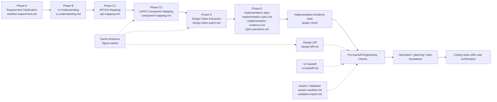

# ora-figma-skills

**English** | [中文](./README.zh-CN.md)

Figma workflow skills for Codex and Claude Code.

`ora-figma-skills` turns Figma design context, product requirements, API structures, and UI/API mappings into reviewable engineering handoff materials before coding starts. The suite focuses on preparation, validation, and handoff. It does not directly modify business application code.

## What This Repository Provides

- Standalone Codex skills for Figma-to-engineering workflows.
- A Claude Code plugin distribution for the same skills.
- A phase-based workflow that produces structured Markdown artifacts under `docs/design/<feature>/`.
- Engineering checks for design diffs, UI handoff quality, asset readiness, validation reports, and implementation evidence.

## Figma Workflow Suite

`figma-workflow` is the orchestrator. It reads the artifact state in `docs/design/<feature>/`, advances the workflow across Phase A-E, and shows review gates before handoff.



The main workflow keeps seven skills in the critical path: `figma-workflow` plus the six Phase A-E skills. Engineering skills are used as needed and do not change the Phase A-E coding boundary.

## Skills

### Main Workflow

- `figma-workflow`: orchestrates the workflow from artifact state, shows progress panels, review gates, engineering checks, and handoff options.
- `figma-clarify-requirement`: turns user requirements into `clarified-requirement.md` for Phase A.
- `figma-ui-understand`: extracts page structure, repeated patterns, component candidates, and UI semantics from a Figma node into `ui-understanding.md` for Phase B.
- `figma-api-first`: turns API structures, response types, or field lists into `api-mapping.md` for Phase C1.
- `figma-ui-api-mapper`: merges Figma node context with `api-mapping.md` and produces `component-mapping.md` for Phase C2.
- `figma-design-token`: extracts visual tokens from a Figma node and produces `design-token-patch.md` for Phase D.
- `figma-emit-spec`: merges upstream artifacts into `implementation-spec.md`, `implementation-evidence.md`, and `open-questions.md` for Phase E.

### Engineering Checks

- `figma-design-diff`: compares cached Figma evidence and produces `design-diff.md` with recommended rerun phases.
- `figma-ui-handoff`: produces `ui-handoff.md` to help design and product teams fill missing upstream handoff details.
- `figma-assets-validate`: produces `assets-manifest.md` and `validation-report.md` for asset delivery and validation readiness.
- Implementation evidence gate: checks whether `implementation-evidence.md` includes module-level token evidence, snapshot evidence, and a coding checklist before handoff.

Downstream coding agents must fill `docs/design/<feature>/implementation-verification.md` before claiming coding is complete. That file records evidence read, token usage, snapshot or visual baseline validation, and intentional deviations.

## Install

The recommended installation mode is mixed:

- Codex uses standalone skills.
- Claude Code uses the `ora-figma-skills` plugin.

```bash
./scripts/install.sh
```

After running the script:

- Codex skills are linked into `~/.codex/skills`.
- Claude Code registers this repository as a marketplace and installs or updates `ora-figma-skills@ora-figma-skills`.
- Duplicate installs left by the opposite installation mode are cleaned up.

To install only standalone Codex skills:

```bash
./scripts/install.sh skills
```

## Update

After pulling repository updates, run the same script again:

```bash
./scripts/install.sh
```

If you use standalone skills only, run:

```bash
./scripts/install.sh skills
```

`update` refreshes the default mixed install:

- Codex standalone skills are updated.
- The Claude Code plugin is updated.
- Duplicate stale installs are cleaned up.

## Target Paths

- Codex skills: `~/.codex/skills`
- Claude Code skills: `~/.claude/skills`
- Claude Code plugin: `~/.claude/plugins/ora-figma-skills`

## Skill Directory Structure

Each skill lives in its own directory and generally follows this structure:

```text
<skill-name>/
├── SKILL.md
├── agents/
│   └── openai.yaml
├── references/
└── scripts/
```

Some skills omit `references/` or `scripts/` when they do not need those resources.

## Repository Boundary

This repository prepares implementation materials for business projects. It should not directly change downstream business code. Generated artifacts should stay in the target project's `docs/design/<feature>/` directory, while raw Figma evidence belongs in `.figma-cache/` and should not be copied into Phase A-E Markdown outputs.
