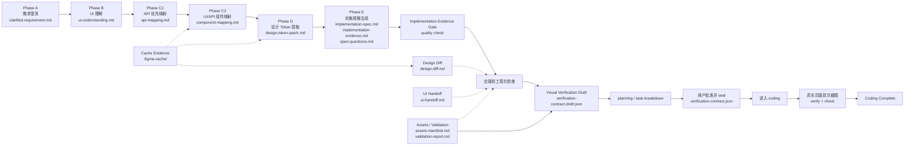

# ora-figma-skills

[English](./README.md) | **中文**

面向 Codex 和 Claude Code 的 Figma workflow skills 仓库。

`ora-figma-skills` 聚焦把 Figma 设计上下文、需求说明、接口结构和 UI/API 映射整理成 coding 前可审阅的工程交接材料。这套技能只负责设计实现准备、工程化检查和交接，不直接修改业务项目代码。

## 仓库提供什么

- 面向 Codex 的 standalone skills。
- 面向 Claude Code 的同源 plugin 分发。
- 基于阶段的 workflow，在 `docs/design/<feature>/` 下生成结构化 Markdown 产物。
- 面向设计 diff、UI handoff、资源交付、验证报告和 implementation evidence 的工程化检查。

## Figma Workflow Suite

`figma-workflow` 是入口编排器。它会读取 `docs/design/<feature>/` 下的产物状态，推进 Phase A-E，并在 handoff 前展示 review gate 和工程化检查。



主链路保持 7 个 skill：`figma-workflow` + Phase A-E 的 6 个阶段 skill。工程化能力按需使用，不改变 Phase A-E 的 coding boundary。

## 最佳案例入口

- 统一 golden path 说明：[docs/examples/figma-workflow-best-case/README.md](./docs/examples/figma-workflow-best-case/README.md)
- fixture 覆盖矩阵：[docs/examples/figma-workflow-best-case/fixture-coverage.md](./docs/examples/figma-workflow-best-case/fixture-coverage.md)

当前每个主 phase 都有可 review 的 expected output；覆盖矩阵会明确标出它们是否来自同一个 feature 链路，以及后续如果要补单一 feature A-E golden path 应优先补哪些 fixture。

## 技能列表

### 主链路技能

- `figma-workflow`：按产物状态驱动 workflow，展示进度面板、review gate、工程化检查和 handoff 出口。
- `figma-clarify-requirement`：把用户需求整理成 `clarified-requirement.md`，对应 Phase A。
- `figma-ui-understand`：从 Figma node 提取页面结构、重复模式、疑似组件和 UI 语义，输出 `ui-understanding.md`，对应 Phase B。
- `figma-api-first`：把接口结构、返回值类型或字段清单整理成 `api-mapping.md`，对应 Phase C1。
- `figma-ui-api-mapper`：合并 Figma node 上下文和 `api-mapping.md`，输出 `component-mapping.md`，对应 Phase C2。
- `figma-design-token`：从 Figma node 抽取视觉 token，输出 `design-token-patch.md`，对应 Phase D。
- `figma-emit-spec`：合并上游产物，输出 `implementation-spec.md`、`implementation-evidence.md` 和 `open-questions.md`，对应 Phase E。

### 工程化技能

- `figma-design-diff`：基于缓存的 Figma evidence 生成 `design-diff.md`，提示 recommended rerun phases。
- `figma-ui-handoff`：生成 `ui-handoff.md`，帮助设计/产品补齐上游交接信息。
- `figma-assets-validate`：生成 `assets-manifest.md` 与 `validation-report.md`，收口资源交付和自动化验证。
- `figma-implementation-verify`：生成并冻结视觉验证契约，对真实实现页面执行 Playwright Chromium 双次截图、pixel diff 与关键视觉断言，并机器生成 `implementation-verification.md`。
- Implementation evidence gate：handoff 前检查 `implementation-evidence.md` 是否包含 module-level token evidence、snapshot evidence 和 coding checklist。

planning 前生成 `verification-contract.draft.json`，coding 前必须由用户批准并 seal。下游 coding agent 声明 coding complete 前必须运行 `figma-implementation-verify verify` 与 `check`；`implementation-verification.md` 由验证器生成，禁止手填。

## 安装

推荐使用混合安装：

- Codex 使用 standalone skills。
- Claude Code 使用 `ora-figma-skills` plugin。

```bash
./scripts/install.sh
```

执行后：

- Codex 会把技能同步到 `~/.codex/skills`。
- Claude Code 会注册本仓库为 marketplace，并安装或更新 `ora-figma-skills@ora-figma-skills`。
- 脚本会清理这套仓库在相反安装形态下留下的重复项。

如果只想安装 Codex standalone skills：

```bash
./scripts/install.sh skills
```

## 更新

仓库更新后，重新运行同一个脚本即可：

```bash
./scripts/install.sh
```

如果使用 standalone skills 模式：

```bash
./scripts/install.sh skills
```

`update` 会刷新默认混合模式：

- Codex 更新 standalone skills。
- Claude Code 更新 `ora-figma-skills` plugin。
- 清理重复或过期安装。

## 目标路径

- Codex skills：`~/.codex/skills`
- Claude Code skills：`~/.claude/skills`
- Claude Code plugin：`~/.claude/plugins/ora-figma-skills`

## 技能目录结构

每个技能都放在独立目录里，通常保持以下结构：

```text
<skill-name>/
├── SKILL.md
├── agents/
│   └── openai.yaml
├── references/
└── scripts/
```

如果某个技能不需要 `references/` 或 `scripts/`，可以不创建对应目录。

## 仓库边界

本仓库只为业务项目准备实施材料，不直接修改下游业务代码。生成产物应保存在目标项目的 `docs/design/<feature>/` 目录下；raw Figma evidence 属于 `.figma-cache/`，不要复制进 Phase A-E 的 Markdown 输出。
